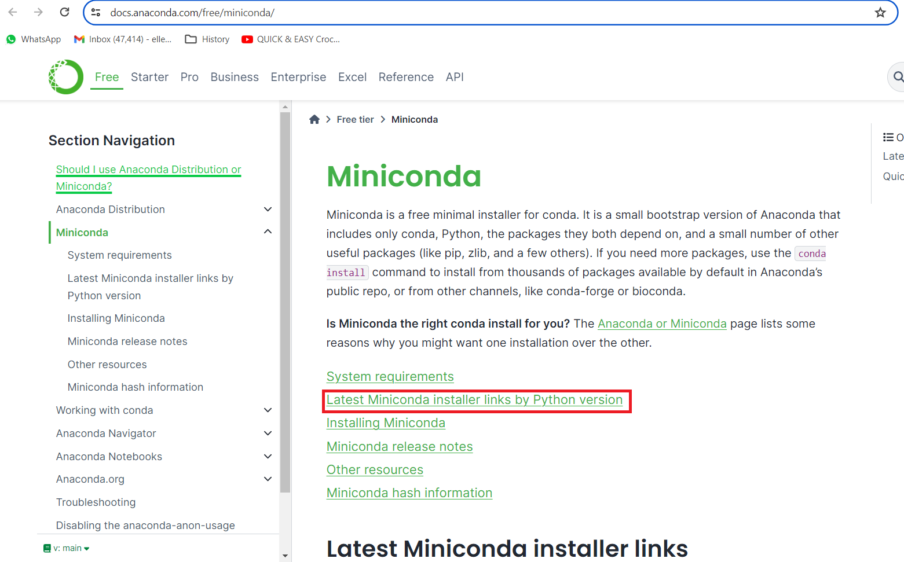
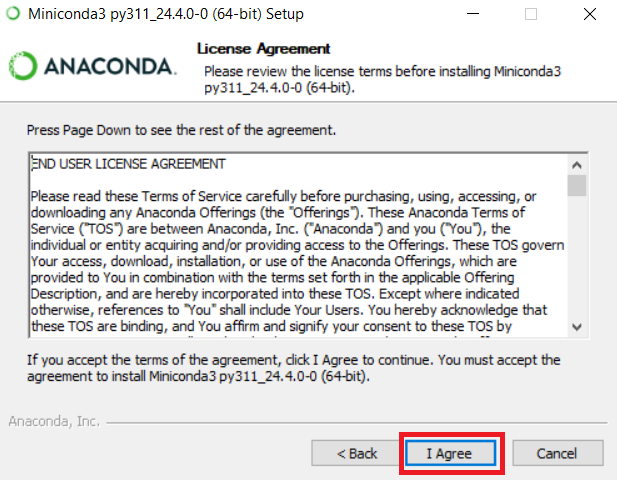

# Installing software tools

## Windows

The materials for the download and set-up below build on the excellent [lecture of Quisheng Wu on Youtube](https://www.youtube.com/watch?v=9zmXL2ppves&list=PLAxJ4-o7ZoPcD-6wZ2xY5bXuu48Scu8kq&index=2) for the course [Geographic Software Design](https://www.youtube.com/playlist?list=PLAxJ4-o7ZoPcD-6wZ2xY5bXuu48Scu8kq). 

### Anaconda

Python needs to be installed and the [Anaconda distribution](https://www.anaconda.com/) is chosen as the distribution. You can either proceed by downloading the [full installation](https://www.anaconda.com/) by selection the **Free Download** button and follow the steps below: 


You can select the **Skip registration**:


After which the download page will open.

Alternatively, you can download the restricted version ([Miniconda](https://www.anaconda.com/)). Here, we choose to download the restricted version. The reason for doing so is that this program requires less disk space in comparison to the full installation. The full Anaconda distribution comes already with some [packages pre-installed](https://docs.anaconda.com/free/anaconda/pkg-docs/) such as scikit-learn (machine learning), some visualisation packages (seaborn, matplotlib, etc), etc but these will also be installed using the Miniconda installation.  Some of the geospatial packages we will install are already bundled in one package as we will see below (and this may potentially result in some conflicts if the full Anaconda version is used). 

However, the set-up for Anaconda and Miniconda is very similar so the screenshots below can also be used for the settings for the full Anaconda installation. In order to install Miniconda, go to the https://docs.anaconda.com/miniconda/ and click on **Latest Miniconda installer links by Python version**:



Rather than installing the latest version (3.12 at the time of writing), sometimes it is better practice to install the previous version:


In your downloads directory, click on the file that you have just downloaded:


Click on **Next** and accept the license agreement:




Keep on clicking on **Next** and at the page of the **Advanced Installation Options**, you can decide to uncheck **Add Miniconda3 to my PATH environment variable**:


Keep on clicking on **Next** and use the default settings and finish the installation. 

In order to check the installation, type in "miniconda" in the search bar and open the **Anaconda Prompt (miniconda 3)**:


And type:
```
conda
```
If everything is installed properly, you should see no errors:


<!--- Microsoft terminal - TO ADD - Or other? --->


### Visual Studio Code

[Visual Studio Code](https://code.visualstudio.com/) which is a code editor. Alternatives are (among others) [Notepad++](https://notepad-plus-plus.org/), [Sublime Text](https://www.sublimetext.com/), [Vim](https://www.vim.org/), etc. 

From the Visual Studio website, click on the download button:


The following screen shows up from which you can choose the Windows version:


### Github 

First you need to sign up for an account in Github. Navigate to the following website and sign up: 

Download git bash from this link: https://www.git-scm.com/downloads
