# Installing software tools

## Windows

The materials for the download and set-up below build on the excellent [lecture of Quisheng Wu on Youtube](https://www.youtube.com/watch?v=9zmXL2ppves&list=PLAxJ4-o7ZoPcD-6wZ2xY5bXuu48Scu8kq&index=2) for the course [Geographic Software Design](https://www.youtube.com/playlist?list=PLAxJ4-o7ZoPcD-6wZ2xY5bXuu48Scu8kq). 

### Anaconda

Python needs to be installed and the [Anaconda distribution](https://www.anaconda.com/) is chosen as the distribution. You can either proceed by downloading the [full installation](https://www.anaconda.com/) by selection the **Free Download** button and follow the steps below: 


You can select the **Skip registration**:


After which the download page will open.

Alternatively, you can download the restricted version ([Miniconda](https://www.anaconda.com/)). Here, we choose to download the restricted version. The reason for doing so is that this program requires less disk space in comparison to the full installation. The full Anaconda distribution comes already with some [packages pre-installed](https://docs.anaconda.com/free/anaconda/pkg-docs/) such as scikit-learn (machine learning), some visualisation packages (seaborn, matplotlib, etc), etc but these will also be installed using the Miniconda installation.  Some of the geospatial packages we will install are already bundled in one package as we will see below (and this may potentially result in some conflicts if the full Anaconda version is used). 

However, the set-up for Anaconda and Miniconda is very similar so the screenshots below can also be used for the settings for the full Anaconda installation. In order to install Miniconda, go to the https://docs.anaconda.com/miniconda/ and click on **Latest Miniconda installer links by Python version**:


Rather than installing the latest version (3.12 at the time of writing), sometimes it is better practice to install the previous version:

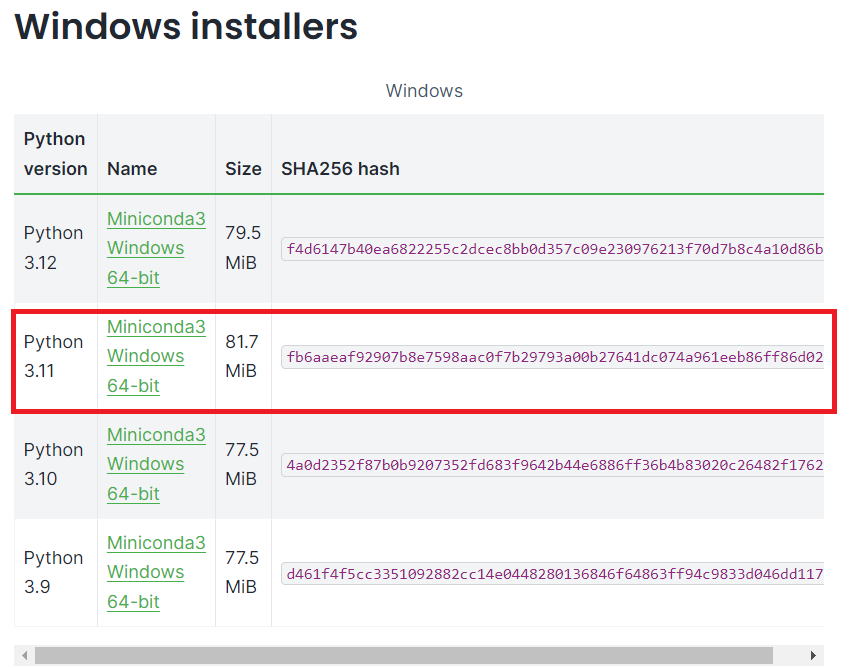

In your downloads directory, click on the file that you have just downloaded:


Click on **Next** and accept the license agreement:

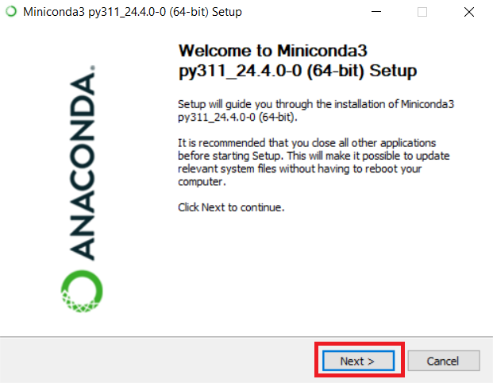


Keep on clicking on **Next** and at the page of the **Advanced Installation Options**, you can decide to uncheck **Add Miniconda3 to my PATH environment variable**:

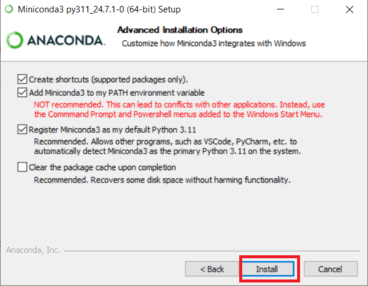

Keep on clicking on **Next** and use the default settings and finish the installation. 

In order to check the installation, type in "miniconda" in the search bar and open the **Anaconda Prompt (miniconda 3)**:


And type:
```
conda
```
If everything is installed properly, you should see no errors:

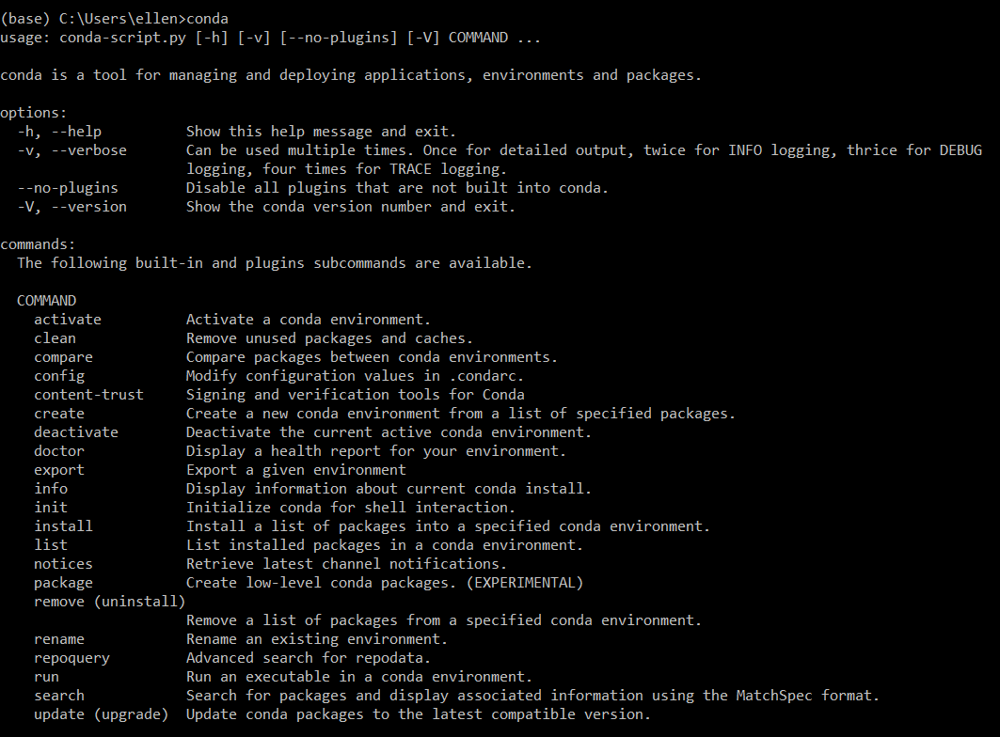

<!--- Microsoft terminal - TO ADD - Or other? --->

For an overview of the main commands, you can look at the [cheatsheet](https://docs.conda.io/projects/conda/en/4.6.0/_downloads/52a95608c49671267e40c689e0bc00ca/conda-cheatsheet.pdf) or the Anaconda [documentation](https://docs.conda.io/projects/conda/en/latest/commands/index.html). 

One important command is the one for installing virtual environments. The reason for creating different Python environments is that each environment is separate and one can e.g. have different Python packages (more below) for each environment. It is e.g. possible to have a certain version of a Python package in one environment and another version in another environment.

Before creating a virtual environment, let us list the environments using the following command:

```
conda env list
```
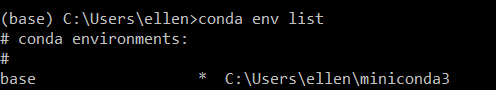

The "*" denotes that this environment is active right now. 

In order to create another environment, let us run the following command where "n" stands for the name:

```
conda create -n geoproject
```
It is advisable not to use the latest version of Python (as sometimes Python packages are not updated). At the time of writing, Python 3.12 is the latest but if we want to use version 3.11, we can write the following command and press **Enter** to actually create the environment:

```
conda create -n geoproject python=3.11
```

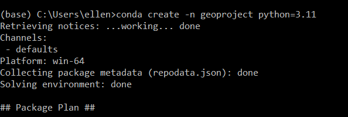

Again, run the command **conda env list** to ensure that you have created the environment:


In order to use the environment, we need to invoke it using:

```
conda activate geoproject
```

If we again use **conda env list**, we see that now the "geoproject" environment is active:


You can also notice this from the Miniconda prompt that looks now like this:


As of now, this is a "bare bones" Python setup. In order to see what packages are already installed, we can type:

```
conda list
```
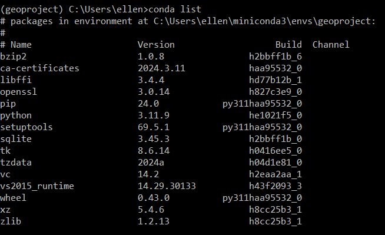

You can add some packages now which will add functionality to your current Python environment. Packages can be found in [pypi.org](https://pypi.org/) and in [Anaconda](https://conda-forge.org/packages/). In what follows, we will use the the packages from the latter as they are better quality controlled. 

The basic command for installing packages is:

```
conda install packagename
```

Rather than using **conda install**, we can use **mamba install**. The reason for doing so is that sometimes using "conda install" can take a long time to resolve dependencies, so we use **mamba install** instead.

First, we need to install mamba itself in the conda environment using the following command. Also, we are using a channel to do so.  In Anaconda, there are "channels" which are places where packages are stored. One important channel is the conda-forge channel which we will use the install the **mamba** package:

```
conda install -c conda-forge mamba
```

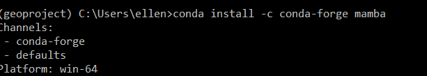

One useful package to deal with vector files is the **geopandas** package. Installing this package can be challenging at times and throws errors. When using Windows, using he conda-forge channel can sometimes lead to errors ([source](https://geospatial.gishub.org/installation/#creating-a-new-conda-environment0). Hence, it is advised to install (using conda or mamba) the geopandas package as follows under Windows:

If using **conda install**:
```
conda install geopandas
```

Or use the following command if using **mamba install**:

```
mamba install geopandas
```

Check if the installation was successful:
```
python
import geopandas as gpd
gpd.__version__
```


If this somehow does not work with mamba install, you could experiment with the conda forge channel anyway by either using **conda install -c conda-forge geopandas**  **mamba install -c conda-forge geopandas**.

Another interesting package is the one developed by Professor Quisheng Wu called [geospatial](https://geospatial.gishub.org/installation/#using-the-conda-forge-channel). The advantage of this package is that it bundles a lot of important geospatial packages such as rasterio, xarray, etc. We can either use **mamba install** or **conda install**. Unlike in the case of the geopandas package, we can use the conda-forge channel. When using **conda install**:

```
conda install -c conda-forge geospatial
```


Next, we also need to install a package in order to be able to use a so called "notebook". In a notebook, you simultaneously can see the code, the output of the code (including visualisation output). There are two options, one is [jupyter notebook]9https://jupyter.org/install0 and the other is [jupyter lab](). If one chooses the install jupyter notebook:

```
conda install notebook
```
```
conda install -c conda-forge notebook
```


Unless you want to stay in your current working directory, at this point you can change the working directory if desired before launching the jupyter notebook.

Imagine you want to change to the following directory, you can type (Windows):

```
cd nameofyournewdirectory
```


To launch the notebook, type:

jupyter notebook

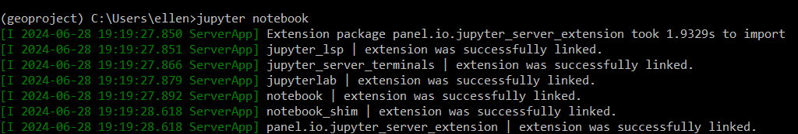

The following will open (assuming you have no files in this directory yet):

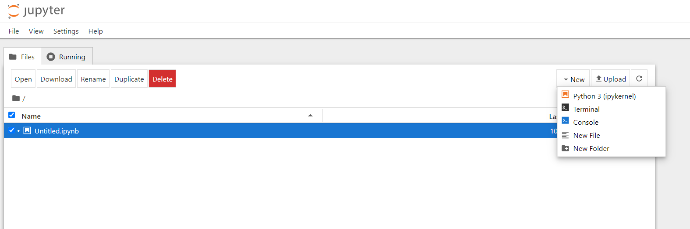

Open a new notebook:

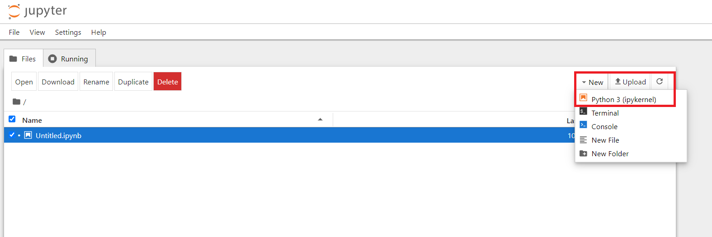

To test your installation, you can e.g. import some geospatial libraries:

```
import geopandas as gpd
import xarray
```
Press **Shift + Enter** to execute the cell. In the next cell, type and again press  **Shift + Enter**: 
```
print(gpd.__version)
print(xr.__version)
```
This is the output you should get:


You can save this notebook:

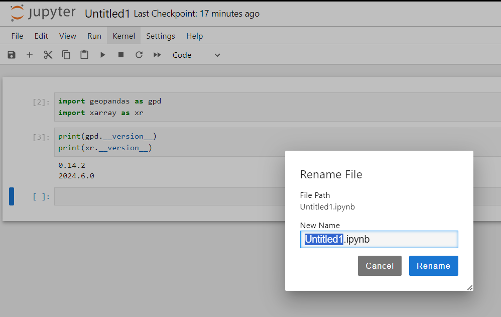

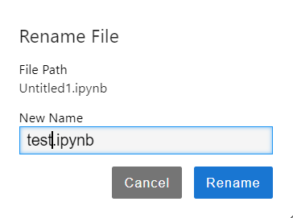

In order to close this jupyter server, go back to the command line and press **Ctrl + C**

Alternatively, you can use jupyterlab. Use the following command to install this:

```
conda install -c conda-forge jupyterlab
```
To launch the code, type:

```
jupyter lab
```
You should get the following page where you need to click on the **Python 3 ipythonkernel**

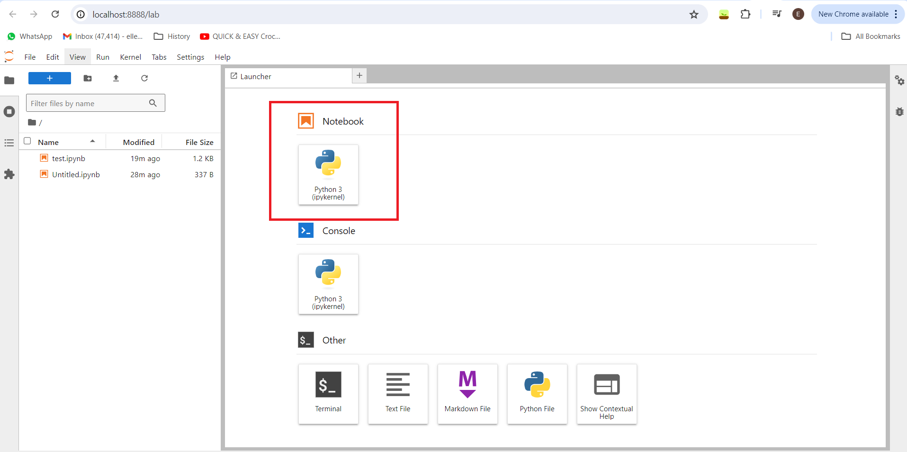

Again you can test if everything works by importing some packages (and renaming the file):

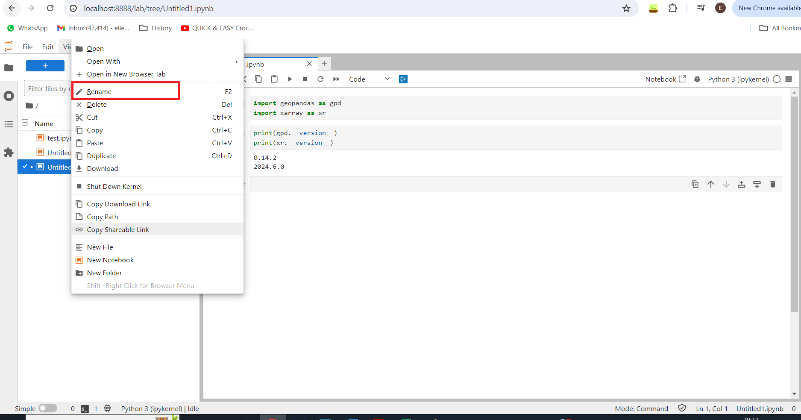

### Visual Studio Code

[Visual Studio Code](https://code.visualstudio.com/) which is a code editor. Alternatives are (among others) [Notepad++](https://notepad-plus-plus.org/), [Sublime Text](https://www.sublimetext.com/), [Vim](https://www.vim.org/), etc. 

From the Visual Studio website, click on the download button:


The following screen shows up from which you can choose the Windows version:


### Github 

First you need to sign up for an account in Github. Navigate to the following website and sign up: https://github.com/

Download git bash from this link: https://www.git-scm.com/downloads
