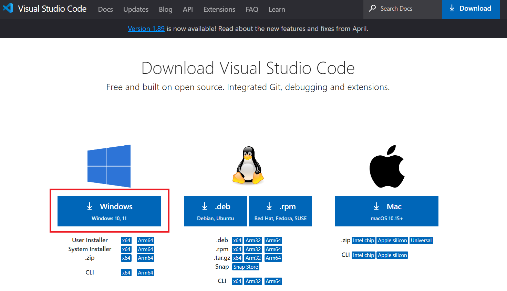
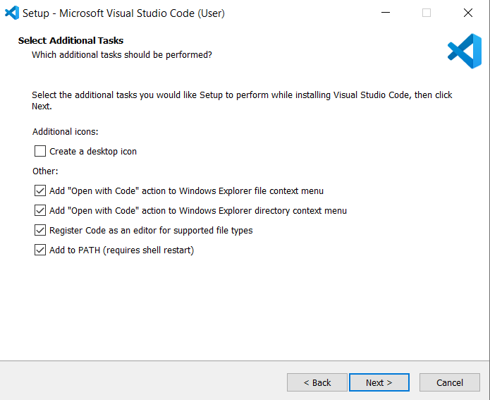
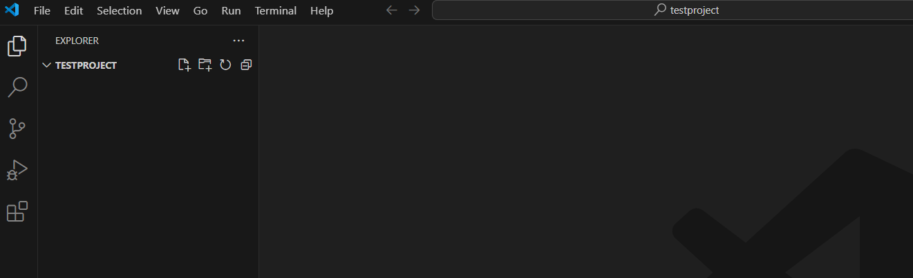
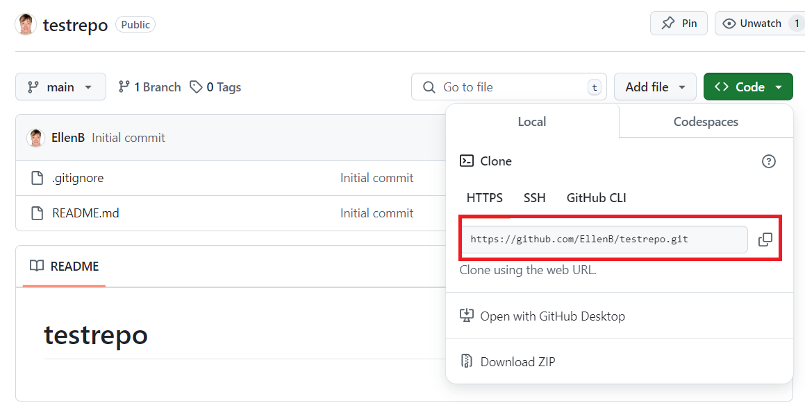
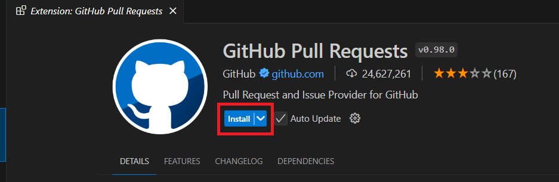
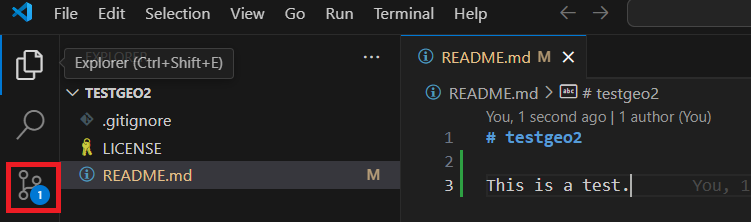
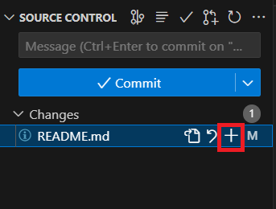

# Installing software tools in Windows

The materials for the download and set-up below build on the excellent [lecture of Quisheng Wu on Youtube](https://www.youtube.com/watch?v=9zmXL2ppves&list=PLAxJ4-o7ZoPcD-6wZ2xY5bXuu48Scu8kq&index=2) for the course [Geographic Software Design](https://www.youtube.com/playlist?list=PLAxJ4-o7ZoPcD-6wZ2xY5bXuu48Scu8kq). 

The steps below are done on a Windows 10 computer. 

### Anaconda/Miniconda

Python needs to be installed and the [Anaconda distribution](https://www.anaconda.com/) is chosen as the distribution. You can either proceed by downloading the [full installation](https://www.anaconda.com/) by selection the **Free Download** button and follow the steps below: 


You can select the **Skip registration**:


After which the download page will open.

Alternatively, you can download the restricted version ([Miniconda](https://www.anaconda.com/)). Here, we choose to download the restricted version. The reason for doing so is that this program requires less disk space in comparison to the full installation. The full Anaconda distribution comes already with some [packages pre-installed](https://docs.anaconda.com/free/anaconda/pkg-docs/) such as scikit-learn (machine learning), some visualisation packages (seaborn, matplotlib, etc), etc but these will also be installed using the Miniconda installation.  Some of the geospatial packages we will install are already bundled in one package as we will see below (and this may potentially result in some conflicts if the full Anaconda version is used). 

However, the set-up for Anaconda and Miniconda is very similar so the screenshots below can also be used for the settings for the full Anaconda installation. In order to install Miniconda, go to the https://docs.anaconda.com/miniconda/ and click on **Latest Miniconda installer links by Python version**:


Rather than installing the latest version (3.12 at the time of writing), version 3.11 is installed as this is a safer option in case some of the packages are not updated yet:


In your downloads directory, click on the file that you have just downloaded:


Click on **Next** and accept the license agreement:


Keep on clicking on **Next** and at the page of the **Advanced Installation Options**, you can decide to uncheck **Add Miniconda3 to my PATH environment variable**. In this example, this option is checked since when it was unchecked this created an issue that Miniconda did not work from VS Code. 


Keep on clicking on **Next** and use the default settings and finish the installation. 

In order to check the installation, type in "miniconda" in the search bar and open the **Anaconda Prompt (miniconda 3)**:


And type:
```
conda
```
If everything is installed properly, you should see no errors:


<!--- Microsoft terminal - TO ADD - Or other? --->

For an overview of the main commands, you can look at the [cheatsheet](https://docs.conda.io/projects/conda/en/4.6.0/_downloads/52a95608c49671267e40c689e0bc00ca/conda-cheatsheet.pdf) or the Anaconda [documentation](https://docs.conda.io/projects/conda/en/latest/commands/index.html). 

One important command is the one for installing virtual environments. The reason for creating different Python environments is that each environment is separate and one can e.g. have different Python packages (more below) for each environment. It is e.g. possible to have a certain version of a Python package in one environment and another version in another environment.

Before creating a virtual environment, let us list the environments using the following command:

```
conda env list
```


The "*" denotes that this environment is active right now. 

In order to create another environment, let us run the following command where "n" stands for the name:

```
conda create -n geoproject
```
It is advisable not to use the latest version of Python (as sometimes Python packages are not updated). At the time of writing, Python 3.12 is the latest but if we want to use version 3.11, we can write the following command and press **Enter** to actually create the environment:

```
conda create -n geoproject python=3.11
```


Again, run the command **conda env list** to ensure that you have created the environment:


In order to use the environment, we need to invoke it using:

```
conda activate geoproject
```

If we again use **conda env list**, we see that now the "geoproject" environment is active:


You can also notice this from the Miniconda prompt that looks now like this:


As of now, this is a "bare bones" Python setup. In order to see what packages are already installed, we can type:

```
conda list
```


You can add some packages now which will add functionality to your current Python environment. Packages can be found in [pypi.org](https://pypi.org/) and in [Anaconda](https://conda-forge.org/packages/). In what follows, we will use the the packages from the latter as they are better quality controlled. 

The basic command for installing packages is:

```
conda install packagename
```

Rather than using **conda install**, we can use **mamba install**. The reason for doing so is that sometimes using "conda install" can take a long time to resolve dependencies, so we use **mamba install** instead.

First, we need to install mamba itself in the conda environment using the following command. Also, we are using a channel to do so.  In Anaconda, there are "channels" which are places where packages are stored. One important channel is the conda-forge channel which we will use the install the **mamba** package:

```
conda install -c conda-forge mamba
```


One useful package to deal with vector files is the **geopandas** package. Installing this package can be challenging at times and throws errors. When using Windows, using he conda-forge channel can sometimes lead to errors ([source](https://geospatial.gishub.org/installation/#creating-a-new-conda-environment0). Hence, it is advised to install (using conda or mamba) the geopandas package as follows under Windows:

If using **conda install**:
```
conda install geopandas
```

Or use the following command if using **mamba install**:

```
mamba install geopandas
```

Check if the installation was successful:
```
python
import geopandas as gpd
gpd.__version__
```


If this somehow does not work with mamba install, you could experiment with the conda forge channel anyway by either using **conda install -c conda-forge geopandas**  or **mamba install -c conda-forge geopandas**.

Another interesting package is the one developed by Professor Quisheng Wu called [geospatial](https://geospatial.gishub.org/installation/#using-the-conda-forge-channel). The advantage of this package is that it bundles a lot of important geospatial packages such as rasterio, xarray, etc. We can either use **mamba install** or **conda install**. Unlike in the case of the geopandas package, we can use the conda-forge channel. When using **conda install**:

```
conda install -c conda-forge geospatial
```


Next, we also need to install a package in order to be able to use a so called "notebook". In a notebook, you simultaneously can see the code, the output of the code (including visualisation output) and write text and equations. There are two options, one is jupyter notebook and the other is jupyter lab [source](https://jupyter.org/install). If one chooses the install jupyter notebook:

```
conda install notebook
```
```
conda install -c conda-forge notebook
```


Unless you want to stay in your current working directory, at this point you can change the working directory if desired before launching the jupyter notebook.

Imagine you want to change to the following directory, you can type (Windows):

```
cd nameofyournewdirectory
```


To launch the notebook, type:

jupyter notebook


The following will open (assuming you have no files in this directory yet):


Open a new notebook:


To test your installation, you can e.g. import some geospatial libraries:

```
import geopandas as gpd
import xarray
```
Press **Shift + Enter** to execute the cell. In the next cell, type and again press  **Shift + Enter**: 
```
print(gpd.__version)
print(xr.__version)
```
This is the output you should get:


You can save this notebook:


In order to close this jupyter server, go back to the command line and press **Ctrl + C**

Alternatively, you can use jupyterlab. Use the following command to install this:

```
conda install -c conda-forge jupyterlab
```
To launch the code, type:

```
jupyter lab
```
You should get the following page where you need to click on the **Python 3 ipythonkernel**


Again you can test if everything works by importing some packages (and renaming the file):


### Visual Studio Code

Rather than resorting to only using the jupyter notebook or jupyter lab, it is better to work with a code editor. This allows one to build the code more modular and use a mix of "plain" python script (.py) and notebooks. Moreover, a code editor has some other advantages too such as using tools (more below) that make your code more error-free, modular, efficient and more elegant. 

We use [Visual Studio Code](https://code.visualstudio.com/) as a code editor. Alternatives are (among others) [Notepad++](https://notepad-plus-plus.org/), [Sublime Text](https://www.sublimetext.com/), [Vim](https://www.vim.org/), etc. 

From the Visual Studio website, click on the **download** button:


The following screen shows up from which you can choose the Windows version:


Click on all the default settings. However, on the following page, check all the boxes:


In order to open VSCode, go to the Windows prompt and start typing "VSCode" and select Visual Studio Code:

 

This page (or a page looking similar should open):


You can also pin the VSCode to the taskbar:


From which you can easily open VSCode by clicking on the icon:


Another way to open the code is to go to a directory of your choice from where you want to launch your project from:


Alternatively, you can open the **Command prompt**:


And using the **cd** (change directory) command to navigate to your folder of interest and type **code .**:


This results in the following screen where you can notice that the VSCode has opened in the project directory:


VSCode should open automatically. In case this does not happen, please follow the steps from this [Medium post](https://abhishekthatguy.medium.com/how-to-fix-visual-studio-code-with-the-terminal-code-command-not-working-95ce0f9c23a2).

And one more way is to open the VSCode (e.g. from the taskbar or from the Windows start button). The following screen opens:


After which you need to click on the **Explorer** in the upper left. To open the same project repository from above, we can select it:


As a result, VSCode is in the project directory:



Also notice that that there is an option to download a Github repository (more later). 

Above, it was shown how to create a virtual environment from the Anaconda command prompt. However, we can also do that from within VSCode. More specifically, select the **Terminal/New Terminal** from the menu:


After which the following screen opens from which you have to select the **Command Prompt** from the menu in the lower right corner:


This is just one way to create a virtual environment. Other options are: [Venv](https://docs.python.org/3/library/venv.html), [Virtualenv](https://virtualenv.pypa.io/en/latest/user_guide.html), [Pyenv](https://github.com/pyenv/pyenv) and [Poetry](https://python-poetry.org/docs/managing-environments/).    

An overview article can be found on the [website of Real Python](https://realpython.com/python-virtual-environments-a-primer/). For a practical example of some of the different ways, please see also the [YouTube video of Krish Naik](https://www.youtube.com/watch?v=bf7pCxj6mEg) (among others).

In order to create the virtual environment, you can use the command (similar to what we had typed in before in the Anaconda command prompt):

```
conda create -n geoproject python=3.11
```


Subsequently, you can use the same steps as the ones we have done above to install the packages. In case this does not work and you get the "Conda Not Recognized" error, you can use this [link](https://stackoverflow.com/questions/44515769/conda-is-not-recognized-as-internal-or-external-command) to try to solve this issue.

### Github 

These steps and the settings follow the [YouTube videos of Professor Quisheng Wu](https://www.youtube.com/watch?v=9zmXL2ppves&list=PLAxJ4-o7ZoPcD-6wZ2xY5bXuu48Scu8kq&index=2):

First you need to sign up for an account in Github. Navigate to the following website and sign up: https://github.com/

Download git bash from this link: https://www.git-scm.com/downloads and select the appropriate operating system:


And select the appropriate installation file (64 bit in my case):


Which downloads the file on your hard disk:


Double click on this and the installation will start. 

In general, all the defaults can be accepted but there are a few suggestions. Since there is a nice integration between Github and VSCode, you can select "Using Visual Studio Code as Git's default editor" instead of using Vim as the default editor:


For the next steps, you can just accept the defaults after which the installation will start. When done, you can check the box "Launch Git Bash":


After which the Git Bash will open:


If Git Bash is open and you type **Git**, you should see the following output:

 

 The next step is to initialise Github. In order to do so, go to the Git Bash prompt and type:

```
git config --global user.name "Put your Your Name here (this does not need to be your userid)"
```
Next, type:
```
git config --global user.email "youremail@something.com"
```
To check if it has worked:

```
git config --global --list
```
You should see something like this:


To test this further, let us "copy" (or in "GitHub language" we call this "clone") any repository to your local computer. As an example, take the following repository: https://github.com/EllenB/testrepo

In Git Bash, navigate to a local directory of your choise where you want to place the Github repository. E.g. in Windows the directory is: 'C:\Ellen\personal\projects\software\testrepo'

Git Bash works like a Unix system so if you are going to type "cd 'C:\Ellen\personal\projects\software\testrepo" in Git Bash this will throw an error (as we cannot to use Unix syntax like this:

```
cd /c/Ellen/personal/projects/software
```
After which we go to [testrepo on Github](https://github.com/EllenB/testrepo) (which can be any GitHub repository of your choice) and copy the link under "HTPPS":



Back in Gitbash, type:

```
git clone https://github.com/EllenB/testrepo.git
```
And you see the something like this:


If you now navigate to your directory, you should see that the content of the Github repository is downloaded on your local computer.


Following the [YouTube lecture of Quisheng Wu](https://www.youtube.com/watch?v=DoiAux0XYfs&list=PLAxJ4-o7ZoPcD-6wZ2xY5bXuu48Scu8kq&index=4), we can also use Github from within VSCode. 

Now, open VSCode again. While we can push and pull code from Github from Git Bash, we can also do that from within VSCode. There are two ways of doing so in VSCode. One is from the command line (similar from where we create the Conda environment) and the other is by using an integration in VSCode itself (with the use of extensions and an extra setup). In order to do the latter, in the lower left corner go to the "Accounts" icon:


After which you click on "Sign in":


Select "Sign in with Github":


GitHub will ask for authorisation:


You will be asked to open VSCode:


To see if this setup has worked, you should see in the lower left that the "Settings Sync is On" and that your Github profile is now added:


VSCode extensions are tools that you can plug in VSCode that help you interacting with programming languages (such as Pyton or other), help you writing better code such as linters, debuggers, etc (more later **TO ADD**) [source](https://code.visualstudio.com/docs/editor/extension-marketplace). An overview of the VS Code extensions can be found in the [VSCode market place](https://marketplace.visualstudio.com/vscode).

Here, we will only install Git/Github related exentions and later on dive deeper into other Python or linting examples and give more detailed examples. To install extensions, you need to go to the "Extensions" tab at the left of the screen:


The following extensions are installed (following the [link](https://sites.google.com/utk.edu/geog-510/resources/software?authuser=0) of Professor Quisheng Wu). In order to explore this list a bit yourself, you can type in "Github" in the search bar:


And then click on any extension and read the description of it. The following extensions will be installed:

- [Github Pull Requests and Issues](https://marketplace.visualstudio.com/items?itemName=GitHub.vscode-pull-request-github): Handles pull requests directly in VSCode. 
- [GitLens](https://www.gitkraken.com/gitlens): This extension visual shows a timeline of your project’s history, visualises changes, etc. 

In order to install an extension, you need to click on "Install":



Other extensions related to Github you may think about are:

- [GitHub Copilot](https://docs.github.com/en/copilot): This is extension is not free (at the time of writing). This extension assists in writing code using Artificial Intelligence (AI). It may be possible that this is (still) free for students and teachers as per this [link](https://dev.to/twizelissa/how-to-enable-github-copilot-for-free-as-student-4kal).

- [GitHub Copilot Chat](https://marketplace.visualstudio.com/items?itemName=GitHub.copilot-chat) - ChatGPT but for Copilot.

More information can be found on the [VS Code website "Introduction to Git in VS Code"](https://code.visualstudio.com/docs/sourcecontrol/intro-to-git)

As mentioned, other Python extensions will be addressed in another chapter. 

To test at a basic level how Github works, you can set up a project in Github. Go to your Github account and click on the "+" icon to create a new project:


You can name this repo anything you want. In the case here, it is called "testgeo2".

You can either have a public or private repository. In the example below a public repository is chosen. You can also add a README.md file. This file is like the "frontpage" of your repository where you can write a description, links to your code, etc. We can also select "Add .gitignore". More later about this but as of now, choose Python from the list:


Next, you can also choose a license if you want (e.g. the MIT License). When finished, click on "Create repository":


You should see something like this:


Now open VSCode. If some file is open or folder is open, go to the menu and click on "File/Close folder". Your screen should look something like this:


Click on "Clone Git Repository":


Then, click on "Clone from Github":


You will see that the extension wants to sign in using Github:


You need to give some extra permissions to Github:


You may be prompted to open VSCode again. After which you should see all your repositories:


From which you can open the repository you just created. You will be asked where to store this repository and after you select your repository, click on "Select as Repository Destination":


You will be asked if you want to "Open the cloned repository" and you click "Open". And now you see that the cloned repository in VSCode:


Assume we want to change something and push it/update it to the Github repository. Open the README.md file by clicking on the file in the left:


You should also see this directory now on your computer:


Added to this, you should also see a .git file. If you do not see it, you can either right click in this directory and click "View" and click on "Hidden files":


After which you will see the .git file:


This means that your file is being tracked!

Let us bring a change in the file and upload the change in the Github repo. In order to do so. Open the README.md file by clicking on it:


And type anything text you want. As an example, type:

```
This is a test.
```

And save the file (either from the menu or by using Ctrl + C). On the left most bar, you should see on the icon that looks like a fork the number of changes you have done. Don't worry if this number is a bit different:



Click on it and you should see something like that:


If you click the README.md file once more, a window on the right opens up from which you see the before and after code where the green color shows what you have added:


Before the updated code gets pushed/committed to Github, we need to stage it first. "Staging" means that you have finished a part of the work and are ready to commit. You need to click on the "+" sign:



Before committing/pushing the code, you need to write a message which you have to do in the upper left where you see "commit". As an example, I put "first commit". After this you can click on "Commit" or use the shortcut key Ctrl + Enter. The first time, you do that some messages may be asked.


Next, this will ask to "Sync the changes":


After which you you may get the following message for which you need to click "OK":


The end result is that the Github repository is updated:


